# [📈 Live Status](https://status.alaskaconsultinggroup.com): <!--live status--> **🟧 Partial outage**

This repository contains the open-source uptime monitor and status page for [Alaska Consulting Group](www.alaskaconsultinggroup.com), powered by [Upptime](https://github.com/upptime/upptime).

With [Upptime](https://upptime.js.org), you can get your own unlimited and free uptime monitor and status page, powered entirely by a GitHub repository. We use [Issues](https://github.com/alaskacg/alaska-status/issues) as incident reports, [Actions](https://github.com/alaskacg/alaska-status/actions) as uptime monitors, and [Pages](https://status.alaskaconsultinggroup.com) for the status page.

<!--start: status pages-->
<!-- This summary is generated by Upptime (https://github.com/upptime/upptime) -->
<!-- Do not edit this manually, your changes will be overwritten -->
<!-- prettier-ignore -->
| URL | Status | History | Response Time | Uptime |
| --- | ------ | ------- | ------------- | ------ |
|  [Alaska Metals Exchange](https://alaskametalsexchange.com) | 🟩 Up | [alaska-metals-exchange.yml](https://github.com/alaskacg/alaska-status/commits/HEAD/history/alaska-metals-exchange.yml) | 

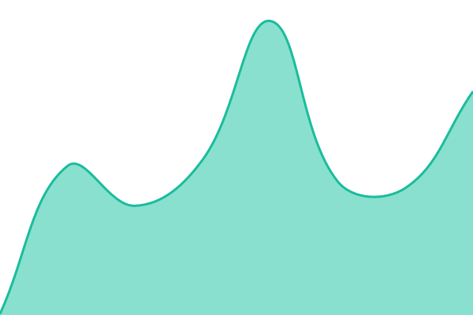 168ms
     
 | 

<a href="https://status.alaskaconsultinggroup.com/history/alaska-metals-exchange">100.00%</a>
    

|  [Alaska Guide Search](https://akguidesearch.com) | 🟩 Up | [alaska-guide-search.yml](https://github.com/alaskacg/alaska-status/commits/HEAD/history/alaska-guide-search.yml) | 

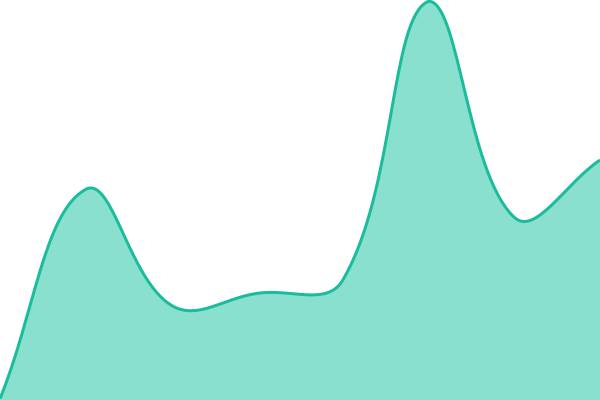 138ms
     
 | 

<a href="https://status.alaskaconsultinggroup.com/history/alaska-guide-search">100.00%</a>
    

|  [Juneau Air](https://juneauair.com) | 🟩 Up | [juneau-air.yml](https://github.com/alaskacg/alaska-status/commits/HEAD/history/juneau-air.yml) | 

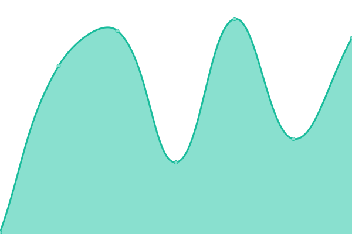 149ms
     
 | 

<a href="https://status.alaskaconsultinggroup.com/history/juneau-air">100.00%</a>
    

|  [Alaska Listings](https://aklistings.com) | 🟩 Up | [alaska-listings.yml](https://github.com/alaskacg/alaska-status/commits/HEAD/history/alaska-listings.yml) | 

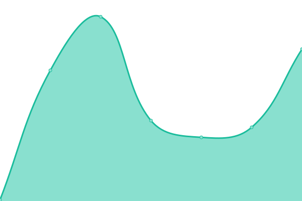 142ms
     
 | 

<a href="https://status.alaskaconsultinggroup.com/history/alaska-listings">100.00%</a>
    

|  [Alaskas Store](https://alaskasstore.com) | 🟩 Up | [alaskas-store.yml](https://github.com/alaskacg/alaska-status/commits/HEAD/history/alaskas-store.yml) | 

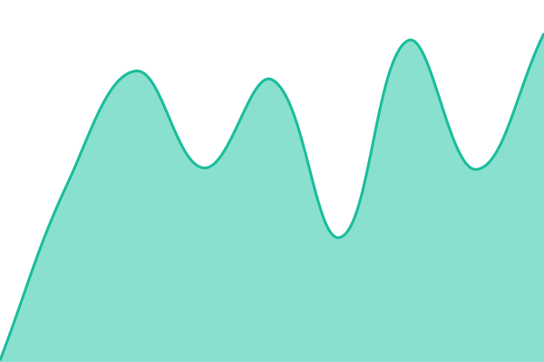 147ms
     
 | 

<a href="https://status.alaskaconsultinggroup.com/history/alaskas-store">100.00%</a>
    

|  [Kenai Borough](https://kenaiborough.com) | 🟩 Up | [kenai-borough.yml](https://github.com/alaskacg/alaska-status/commits/HEAD/history/kenai-borough.yml) | 

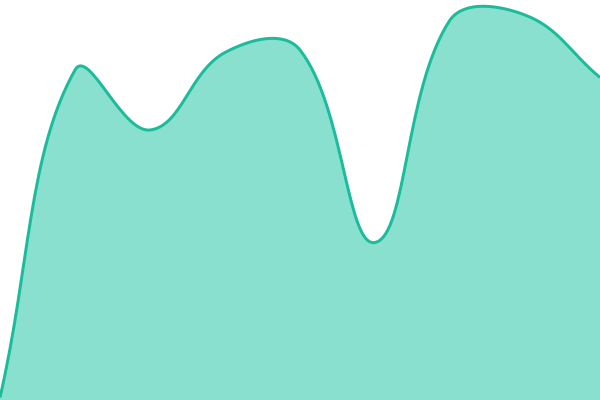 160ms
     
 | 

<a href="https://status.alaskaconsultinggroup.com/history/kenai-borough">100.00%</a>
    

|  [Kenai Listings](https://kenailistings.com) | 🟩 Up | [kenai-listings.yml](https://github.com/alaskacg/alaska-status/commits/HEAD/history/kenai-listings.yml) | 

 164ms
     
 | 

<a href="https://status.alaskaconsultinggroup.com/history/kenai-listings">100.00%</a>
    

|  [Kenai Auto Sales](https://kenaiautosales.com) | 🟩 Up | [kenai-auto-sales.yml](https://github.com/alaskacg/alaska-status/commits/HEAD/history/kenai-auto-sales.yml) | 

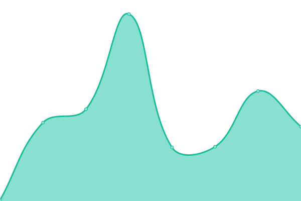 135ms
     
 | 

<a href="https://status.alaskaconsultinggroup.com/history/kenai-auto-sales">100.00%</a>
    

|  [Kenai Peninsula Rentals](https://kenaipeninsularentals.com) | 🟩 Up | [kenai-peninsula-rentals.yml](https://github.com/alaskacg/alaska-status/commits/HEAD/history/kenai-peninsula-rentals.yml) | 

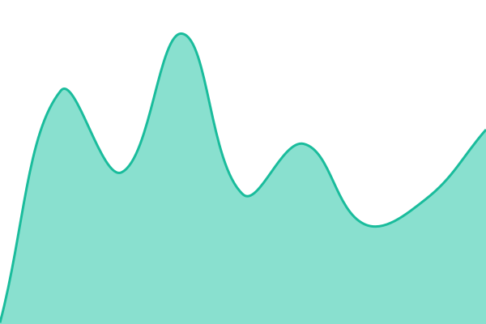 167ms
     
 | 

<a href="https://status.alaskaconsultinggroup.com/history/kenai-peninsula-rentals">100.00%</a>
    

|  [Kenai Land Sales](https://kenailandsales.com) | 🟩 Up | [kenai-land-sales.yml](https://github.com/alaskacg/alaska-status/commits/HEAD/history/kenai-land-sales.yml) | 

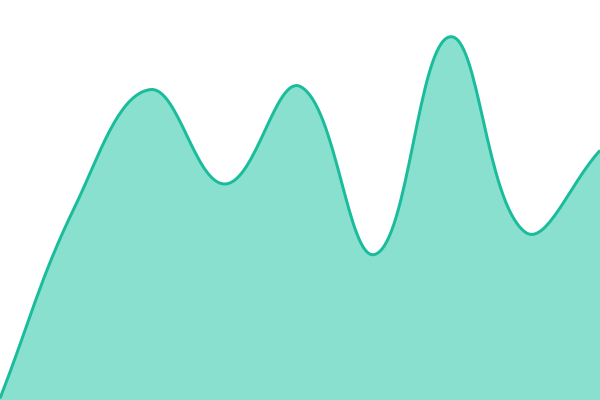 154ms
     
 | 

<a href="https://status.alaskaconsultinggroup.com/history/kenai-land-sales">100.00%</a>
    

|  [Kenai Home Sales](https://kenaihomesales.com) | 🟩 Up | [kenai-home-sales.yml](https://github.com/alaskacg/alaska-status/commits/HEAD/history/kenai-home-sales.yml) | 

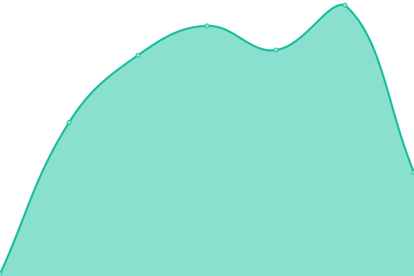 148ms
     
 | 

<a href="https://status.alaskaconsultinggroup.com/history/kenai-home-sales">100.00%</a>
    

|  [Kenai Borough Realty](https://kenaiboroughrealty.com) | 🟩 Up | [kenai-borough-realty.yml](https://github.com/alaskacg/alaska-status/commits/HEAD/history/kenai-borough-realty.yml) | 

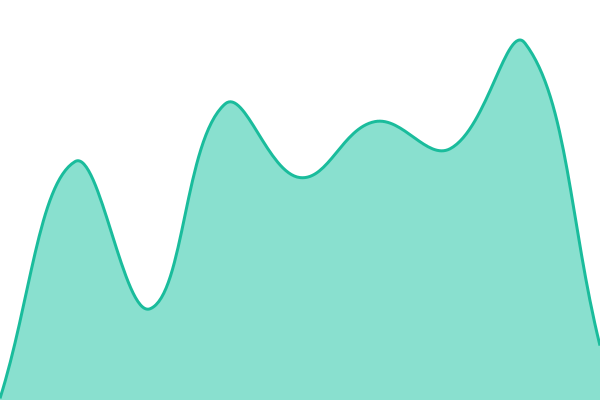 154ms
     
 | 

<a href="https://status.alaskaconsultinggroup.com/history/kenai-borough-realty">100.00%</a>
    

|  [Alaska Consulting Group](https://alaskaconsultinggroup.com) | 🟩 Up | [alaska-consulting-group.yml](https://github.com/alaskacg/alaska-status/commits/HEAD/history/alaska-consulting-group.yml) | 

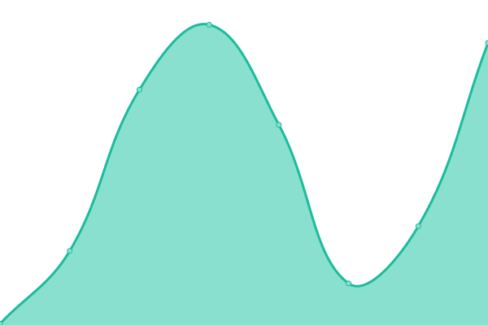 141ms
     
 | 

<a href="https://status.alaskaconsultinggroup.com/history/alaska-consulting-group">100.00%</a>
    

|  [The Alaska Foundation](https://thealaskafoundation.com) | 🟩 Up | [the-alaska-foundation.yml](https://github.com/alaskacg/alaska-status/commits/HEAD/history/the-alaska-foundation.yml) | 

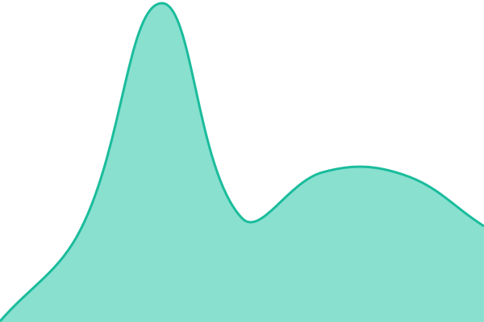 166ms
     
 | 

<a href="https://status.alaskaconsultinggroup.com/history/the-alaska-foundation">100.00%</a>
    

|  [Alaska Domains](https://alaskadomains.com) | 🟩 Up | [alaska-domains.yml](https://github.com/alaskacg/alaska-status/commits/HEAD/history/alaska-domains.yml) | 

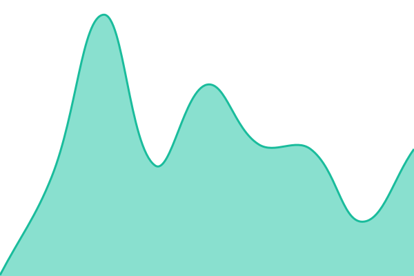 157ms
     
 | 

<a href="https://status.alaskaconsultinggroup.com/history/alaska-domains">100.00%</a>
    

|  [Alaska Drone Survey](https://alaskadronesurvey.com) | 🟩 Up | [alaska-drone-survey.yml](https://github.com/alaskacg/alaska-status/commits/HEAD/history/alaska-drone-survey.yml) | 

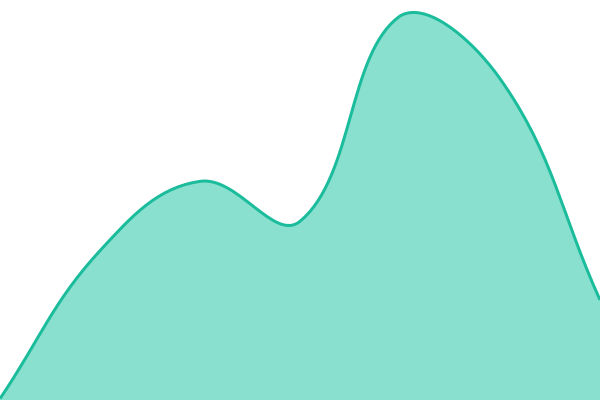 140ms
     
 | 

<a href="https://status.alaskaconsultinggroup.com/history/alaska-drone-survey">100.00%</a>
    

|  [Alaska Mining Equipment](https://alaskaminingequipment.com) | 🟥 Down | [alaska-mining-equipment.yml](https://github.com/alaskacg/alaska-status/commits/HEAD/history/alaska-mining-equipment.yml) | 

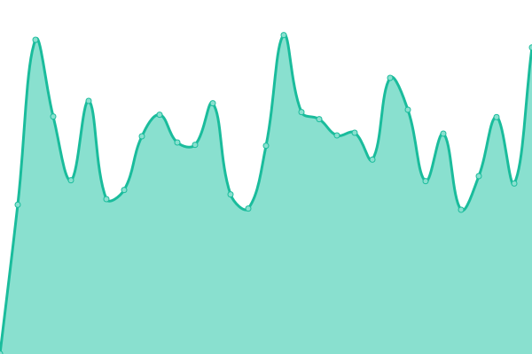 774ms
     
 | 

<a href="https://status.alaskaconsultinggroup.com/history/alaska-mining-equipment">19.61%</a>
    

|  [Alaska News Corporation](https://alaskanewscorporation.com) | 🟩 Up | [alaska-news-corporation.yml](https://github.com/alaskacg/alaska-status/commits/HEAD/history/alaska-news-corporation.yml) | 

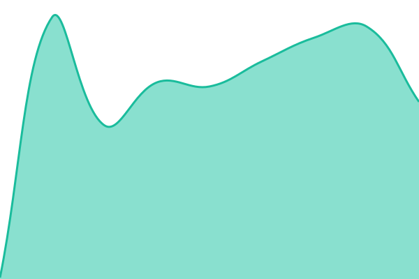 158ms
     
 | 

<a href="https://status.alaskaconsultinggroup.com/history/alaska-news-corporation">100.00%</a>
    

|  [Alaska Gold News](https://alaskagoldnews.com) | 🟩 Up | [alaska-gold-news.yml](https://github.com/alaskacg/alaska-status/commits/HEAD/history/alaska-gold-news.yml) | 

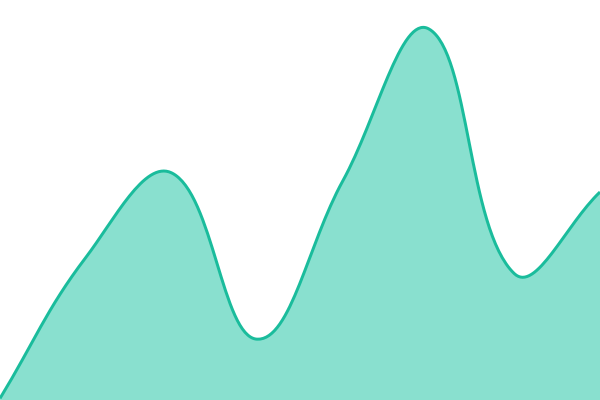 161ms
     
 | 

<a href="https://status.alaskaconsultinggroup.com/history/alaska-gold-news">100.00%</a>
    

|  [Alaska Fires](https://alaskafires.com) | 🟩 Up | [alaska-fires.yml](https://github.com/alaskacg/alaska-status/commits/HEAD/history/alaska-fires.yml) | 

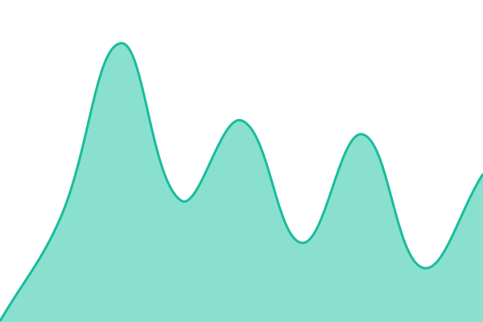 154ms
     
 | 

<a href="https://status.alaskaconsultinggroup.com/history/alaska-fires">100.00%</a>
    

|  [Kenai News](https://kenainews.com) | 🟩 Up | [kenai-news.yml](https://github.com/alaskacg/alaska-status/commits/HEAD/history/kenai-news.yml) | 

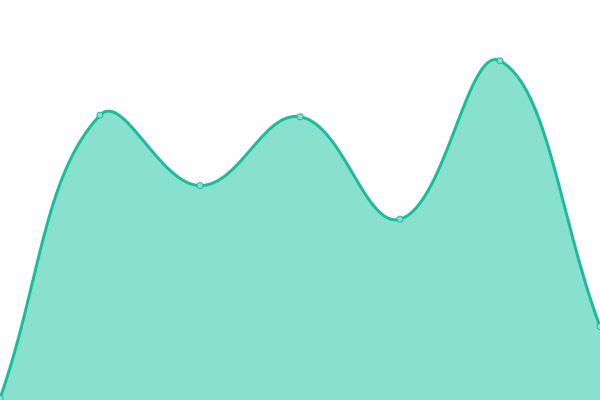 139ms
     
 | 

<a href="https://status.alaskaconsultinggroup.com/history/kenai-news">100.00%</a>
    

|  [Anchorage Chronicle](https://anchoragechronicle.com) | 🟥 Down | [anchorage-chronicle.yml](https://github.com/alaskacg/alaska-status/commits/HEAD/history/anchorage-chronicle.yml) | 

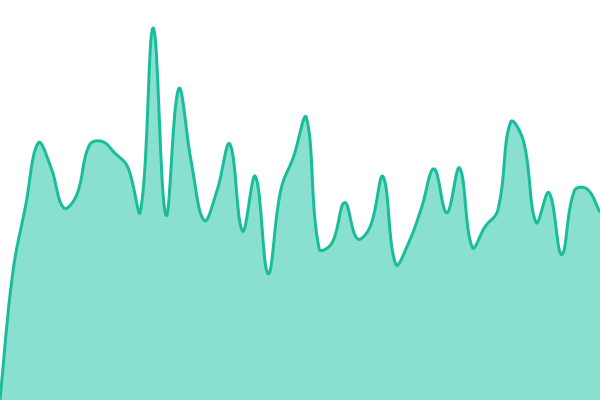 740ms
     
 | 

<a href="https://status.alaskaconsultinggroup.com/history/anchorage-chronicle">12.76%</a>
    

|  [Alaskan Boats](https://alaskanboats.com) | 🟩 Up | [alaskan-boats.yml](https://github.com/alaskacg/alaska-status/commits/HEAD/history/alaskan-boats.yml) | 

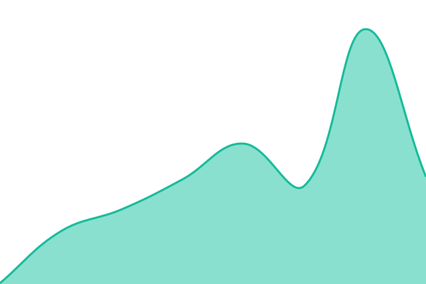 135ms
     
 | 

<a href="https://status.alaskaconsultinggroup.com/history/alaskan-boats">100.00%</a>
    

|  [Alaska Guide Listings](https://alaskaguidelistings.com) | 🟩 Up | [alaska-guide-listings.yml](https://github.com/alaskacg/alaska-status/commits/HEAD/history/alaska-guide-listings.yml) | 

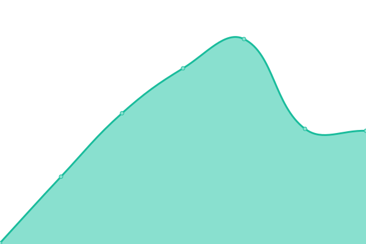 152ms
     
 | 

<a href="https://status.alaskaconsultinggroup.com/history/alaska-guide-listings">100.00%</a>
    

|  [Anchorage Listings](https://anchoragelistings.com) | 🟥 Down | [anchorage-listings.yml](https://github.com/alaskacg/alaska-status/commits/HEAD/history/anchorage-listings.yml) | 

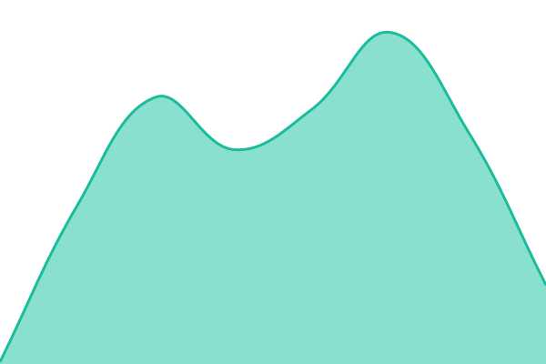 0ms
     
 | 

<a href="https://status.alaskaconsultinggroup.com/history/anchorage-listings">0.00%</a>
    

|  [Alcan Listings](https://alcanlistings.com) | 🟥 Down | [alcan-listings.yml](https://github.com/alaskacg/alaska-status/commits/HEAD/history/alcan-listings.yml) | 

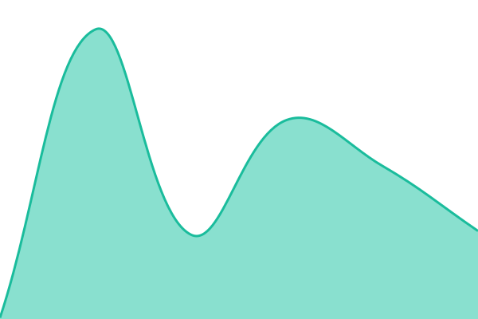 0ms
     
 | 

<a href="https://status.alaskaconsultinggroup.com/history/alcan-listings">0.00%</a>
    

|  [Prudhoe Listings](https://prudhoelistings.com) | 🟥 Down | [prudhoe-listings.yml](https://github.com/alaskacg/alaska-status/commits/HEAD/history/prudhoe-listings.yml) | 

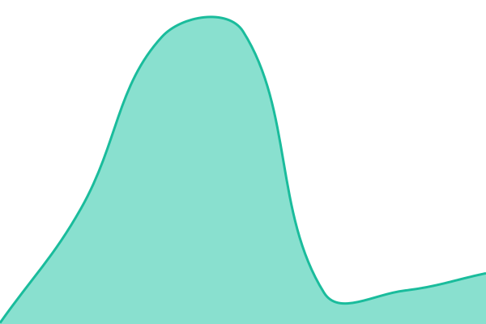 0ms
     
 | 

<a href="https://status.alaskaconsultinggroup.com/history/prudhoe-listings">0.00%</a>
    

|  [Tongass Listings](https://tongasslistings.com) | 🟩 Up | [tongass-listings.yml](https://github.com/alaskacg/alaska-status/commits/HEAD/history/tongass-listings.yml) | 

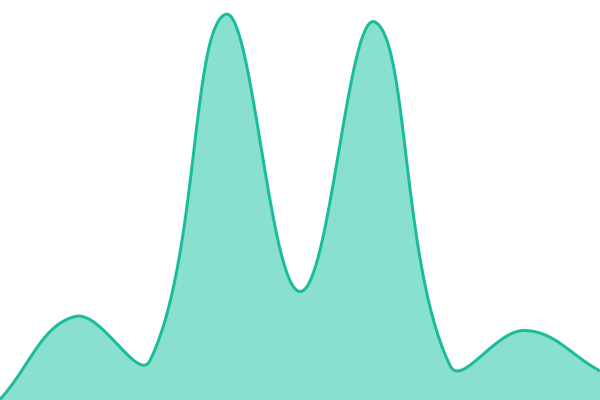 141ms
     
 | 

<a href="https://status.alaskaconsultinggroup.com/history/tongass-listings">100.00%</a>
    

|  [Chugach Listings](https://chugachlistings.com) | 🟩 Up | [chugach-listings.yml](https://github.com/alaskacg/alaska-status/commits/HEAD/history/chugach-listings.yml) | 

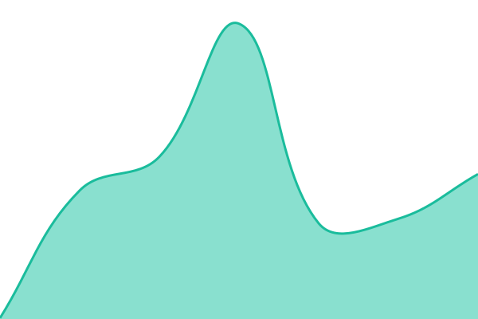 117ms
     
 | 

<a href="https://status.alaskaconsultinggroup.com/history/chugach-listings">100.00%</a>
    

|  [BB Listings](https://bblistings.com) | 🟥 Down | [bb-listings.yml](https://github.com/alaskacg/alaska-status/commits/HEAD/history/bb-listings.yml) | 

 0ms
     
 | 

<a href="https://status.alaskaconsultinggroup.com/history/bb-listings">0.00%</a>
    

<!--end: status pages-->

[**Visit our status website →**](https://status.alaskaconsultinggroup.com)

## 📄 License

- Powered by: [Upptime](https://github.com/upptime/upptime)
- Code: [MIT](./LICENSE) © [Anand Chowdhary](https://anandchowdhary.com), supported by [Pabio](https://pabio.com)
- Data in the `./history` directory: [Open Database License](https://opendatacommons.org/licenses/odbl/1-0/)
