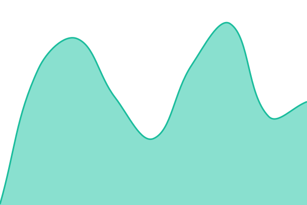
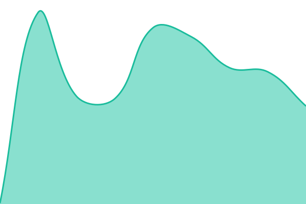
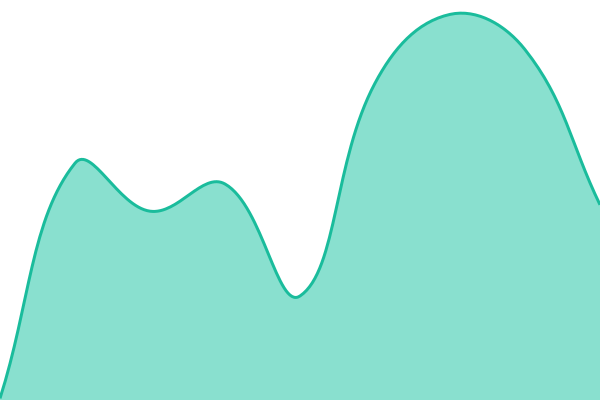

# [📈 Live Status](https://status.alaskaconsultinggroup.com): <!--live status--> **🟧 Partial outage**

This repository contains the open-source uptime monitor and status page for [Alaska Consulting Group](www.alaskaconsultinggroup.com), powered by [Upptime](https://github.com/upptime/upptime).

With [Upptime](https://upptime.js.org), you can get your own unlimited and free uptime monitor and status page, powered entirely by a GitHub repository. We use [Issues](https://github.com/alaskacg/alaska-status/issues) as incident reports, [Actions](https://github.com/alaskacg/alaska-status/actions) as uptime monitors, and [Pages](https://status.alaskaconsultinggroup.com) for the status page.

<!--start: status pages-->
<!-- This summary is generated by Upptime (https://github.com/upptime/upptime) -->
<!-- Do not edit this manually, your changes will be overwritten -->
<!-- prettier-ignore -->
| URL | Status | History | Response Time | Uptime |
| --- | ------ | ------- | ------------- | ------ |
|  [Alaska Metals Exchange](https://alaskametalsexchange.com) | 🟩 Up | [alaska-metals-exchange.yml](https://github.com/alaskacg/alaska-status/commits/HEAD/history/alaska-metals-exchange.yml) | 

 151ms
     
 | 

<a href="https://status.alaskaconsultinggroup.com/history/alaska-metals-exchange">100.00%</a>
    

|  [Juneau Air](https://juneauair.com) | 🟩 Up | [juneau-air.yml](https://github.com/alaskacg/alaska-status/commits/HEAD/history/juneau-air.yml) | 

 171ms
     
 | 

<a href="https://status.alaskaconsultinggroup.com/history/juneau-air">100.00%</a>
    

|  [Alaska Consulting Group](https://alaskaconsultinggroup.com) | 🟩 Up | [alaska-consulting-group.yml](https://github.com/alaskacg/alaska-status/commits/HEAD/history/alaska-consulting-group.yml) | 

 156ms
     
 | 

<a href="https://status.alaskaconsultinggroup.com/history/alaska-consulting-group">100.00%</a>
    

|  [Anchorage Chronicle](https://anchoragechronicle.com) | 🟩 Up | [anchorage-chronicle.yml](https://github.com/alaskacg/alaska-status/commits/HEAD/history/anchorage-chronicle.yml) | 

 820ms
     
 | 

<a href="https://status.alaskaconsultinggroup.com/history/anchorage-chronicle">100.00%</a>
    

|  [Alaska Guide Listings](https://alaskaguidelistings.com) | 🟥 Down | [alaska-guide-listings.yml](https://github.com/alaskacg/alaska-status/commits/HEAD/history/alaska-guide-listings.yml) | 

 0ms
     
 | 

<a href="https://status.alaskaconsultinggroup.com/history/alaska-guide-listings">0.00%</a>
    

|  [Anchorage Listings](https://alaskacg.github.io/anchorage-listings/) | 🟩 Up | [anchorage-listings.yml](https://github.com/alaskacg/alaska-status/commits/HEAD/history/anchorage-listings.yml) | 

 125ms
     
 | 

<a href="https://status.alaskaconsultinggroup.com/history/anchorage-listings">100.00%</a>
    

|  [Prudhoe Listings](https://alaskacg.github.io/prudhoe-listings/) | 🟩 Up | [prudhoe-listings.yml](https://github.com/alaskacg/alaska-status/commits/HEAD/history/prudhoe-listings.yml) | 

 100ms
     
 | 

<a href="https://status.alaskaconsultinggroup.com/history/prudhoe-listings">100.00%</a>
    

|  [BB Listings](https://bblistings.com) | 🟩 Up | [bb-listings.yml](https://github.com/alaskacg/alaska-status/commits/HEAD/history/bb-listings.yml) | 

 345ms
     
 | 

<a href="https://status.alaskaconsultinggroup.com/history/bb-listings">100.00%</a>
    

<!--end: status pages-->

[**Visit our status website →**](https://status.alaskaconsultinggroup.com)

## 📄 License

- Powered by: [Upptime](https://github.com/upptime/upptime)
- Code: [MIT](./LICENSE) © [Anand Chowdhary](https://anandchowdhary.com), supported by [Pabio](https://pabio.com)
- Data in the `./history` directory: [Open Database License](https://opendatacommons.org/licenses/odbl/1-0/)
