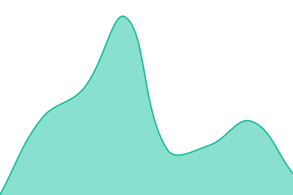

# [📈 Live Status](https://status.alaskaconsultinggroup.com): <!--live status--> **🟩 All systems operational**

This repository contains the open-source uptime monitor and status page for [Alaska Consulting Group](www.alaskaconsultinggroup.com), powered by [Upptime](https://github.com/upptime/upptime).

With [Upptime](https://upptime.js.org), you can get your own unlimited and free uptime monitor and status page, powered entirely by a GitHub repository. We use [Issues](https://github.com/alaskacg/alaska-status/issues) as incident reports, [Actions](https://github.com/alaskacg/alaska-status/actions) as uptime monitors, and [Pages](https://status.alaskaconsultinggroup.com) for the status page.

<!--start: status pages-->
<!-- This summary is generated by Upptime (https://github.com/upptime/upptime) -->
<!-- Do not edit this manually, your changes will be overwritten -->
<!-- prettier-ignore -->
| URL | Status | History | Response Time | Uptime |
| --- | ------ | ------- | ------------- | ------ |
|  [Aether Awareness](https://aetherawareness.com) | 🟩 Up | [aether-awareness.yml](https://github.com/alaskacg/alaska-status/commits/HEAD/history/aether-awareness.yml) | 

 231ms
     
 | 

<a href="https://status.alaskaconsultinggroup.com/history/aether-awareness">100.00%</a>
    

|  [Research The Word](https://researchtheword.com) | 🟩 Up | [research-the-word.yml](https://github.com/alaskacg/alaska-status/commits/HEAD/history/research-the-word.yml) | 

 174ms
     
 | 

<a href="https://status.alaskaconsultinggroup.com/history/research-the-word">100.00%</a>
    

<!--end: status pages-->

[**Visit our status website →**](https://status.alaskaconsultinggroup.com)

## 📄 License

- Powered by: [Upptime](https://github.com/upptime/upptime)
- Code: [MIT](./LICENSE) © [Anand Chowdhary](https://anandchowdhary.com), supported by [Pabio](https://pabio.com)
- Data in the `./history` directory: [Open Database License](https://opendatacommons.org/licenses/odbl/1-0/)
